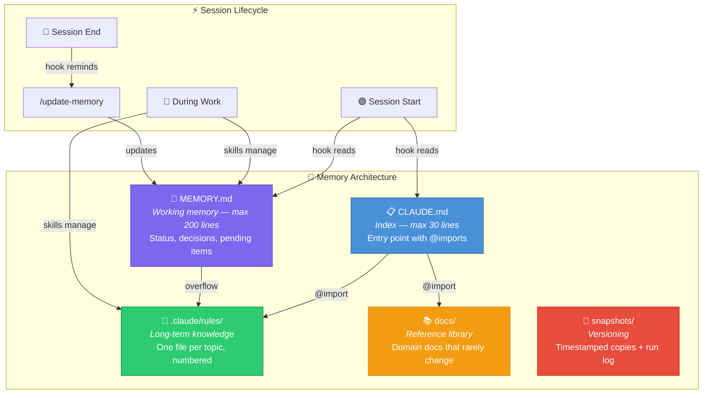

# session-memory

A Claude Code / Cowork plugin that scaffolds and manages a structured memory system for any project — so Claude never forgets your context between sessions.

> **Inspired by** the [official Anthropic best practices for Claude Code memory management](https://code.claude.com/docs/en/memory.md). This plugin packages those patterns into an opinionated, ready-to-use system with commands, skills, and hooks.

## The Problem

Every time you start a new project in Claude Code or Cowork, context gets lost between sessions. You end up repeating yourself, Claude forgets decisions you made, and there's no structured way to track what happened over time.

The official Anthropic documentation recommends using `CLAUDE.md` as a project index, `.claude/rules/` for modular context, and keeping files under 200 lines. But setting all of this up manually for every project is tedious, and there's no built-in mechanism for tracking decisions, pending items, or versioning outputs.

## The Solution

`session-memory` automates the setup and maintenance of a layered memory architecture. Think of it like giving Claude a structured notebook that it reads at the start of every session and updates at the end.

The system has five layers, each with a specific role:



### What each layer does

**CLAUDE.md (Index)** is the front page of the notebook. Claude reads it at the start of every session. It contains nothing but short pointers (`@imports`) to the detailed files. Maximum 30 lines — following Anthropic's recommendation to keep CLAUDE.md concise so Claude reads it reliably.

**MEMORY.md (Working Memory)** tracks the current state of the project: what's working, what decisions were made, what's pending. It's the section of the notebook you flip to when someone asks "where are we?". Maximum 200 lines — when it gets too big, detailed content overflows into `.claude/rules/`.

**.claude/rules/ (Long-term Knowledge)** holds detailed, modular context organized by topic. Each file covers one subject (e.g., `01-project-overview.md`, `02-api-schemas.md`, `03-deployment.md`). These are numbered for ordering and referenced via `@imports` from CLAUDE.md. This follows the official `.claude/rules/` pattern recommended by Anthropic.

**snapshots/ (Versioning)** preserves known-good states of your project outputs. Before you regenerate files, you take a "snapshot" — a timestamped copy that lets you roll back if something breaks. The `SNAPSHOT_HISTORY.md` log records every successful run with dates, file counts, and validation results.

**docs/ (Reference Library)** stores domain-specific documentation that rarely changes — format specifications, external system quirks, detailed business rules. These are referenced from CLAUDE.md but not updated frequently.

## Quick Start

After installing the plugin, run in any project folder:

```
/setup-memory my-project-name
```

Claude will ask you a few questions (project name, description, main topics) and create the entire structure.

## What Gets Created

```
CLAUDE.md                         ← Project index (< 30 lines)
MEMORY.md                         ← Working memory (< 200 lines)
.claude/rules/
  01-project-overview.md          ← Architecture, scripts, setup
  02-[your-topic].md              ← One file per domain topic
  ...
snapshots/
  SNAPSHOT_HISTORY.md             ← Log of all runs/milestones
docs/
  context/                        ← Domain reference material
  projects/                       ← Detailed project docs
```

## Day-to-Day Workflow

Here's what a typical workflow looks like once the memory system is set up:

```
1. Open a new session
   └─> SessionStart hook automatically loads CLAUDE.md + MEMORY.md
       (Claude already knows your project context)

2. Check where things stand
   └─> /status
       (Shows dashboard: last update, pending items, health alerts)

3. Work on your project normally
   └─> Claude uses skills to manage context as you go

4. Before generating outputs or running scripts
   └─> /snapshot
       (Saves a timestamped copy of current outputs for rollback)

5. Run your scripts / generate outputs

6. Before ending the session
   └─> /update-memory
       (Saves decisions, updates status, checks off completed items)
       If you forget, the Stop hook reminds you.
```

## Components

### Commands

| Command | When to use | What it does |
|---------|-------------|--------------|
| `/setup-memory [name]` | Once, at the start of a new project | Asks about your project and creates the full directory structure, CLAUDE.md, MEMORY.md, rules files, and snapshots folder |
| `/status` | Anytime you want a quick overview | Reads MEMORY.md and shows a compact dashboard: current status, pending items by priority, recent decisions, and health warnings (stale memory, overflow risk, missing snapshots) |
| `/snapshot [dir]` | Before running scripts that change output files | Creates a `snapshots/YYYY-MM-DD/` directory with copies of your current outputs, and logs the snapshot in SNAPSHOT_HISTORY.md. If something breaks, you can roll back |
| `/update-memory` | At the end of a session with significant changes | Updates MEMORY.md: refreshes status, appends new decisions to the log, checks off completed items, adds new pending items. If MEMORY.md is too big, moves overflow to `.claude/rules/` |

### Skills (automatic, no command needed)

| Skill | When it activates | What it does |
|-------|-------------------|--------------|
| `memory-management` | When you say things like "save this context", "add this to the rules", "update the project status" | Manages the five layers (CLAUDE.md, MEMORY.md, .claude/rules/, snapshots/, docs/) — knows where to put new knowledge, how to handle overflow, and how to keep the Knowledge Map in sync |
| `snapshot-versioning` | When you say things like "take a snapshot", "backup before running", "what was the last snapshot", "rollback" | Handles the snapshot lifecycle: creating backups, logging runs, and restoring previous states |

### Hooks (fully automatic)

| Event | What happens | Why it matters |
|-------|-------------|----------------|
| `SessionStart` | Claude silently reads CLAUDE.md and MEMORY.md | You never have to say "read my context files" — Claude starts every session already knowing your project |
| `Stop` | If the session had significant changes, Claude suggests running `/update-memory` | Safety net so you don't lose context from a productive session |

## Design Principles

- **Language-agnostic**: all files are written in whatever language you use in conversation
- **Modular**: knowledge is split into small, focused files instead of one giant document — following Anthropic's `.claude/rules/` pattern
- **Append-only logs**: decision logs and snapshot history never lose data
- **Size-bounded**: CLAUDE.md (30 lines) and MEMORY.md (200 lines) have hard limits to keep context loading fast and reliable
- **Convention over configuration**: numbered files, consistent structure, predictable locations — zero config needed

## Compatibility

This plugin works with both **Claude Code** (terminal) and **Claude Cowork** (desktop app). The plugin format is the same for both — commands, skills, and hooks behave identically in either environment.
